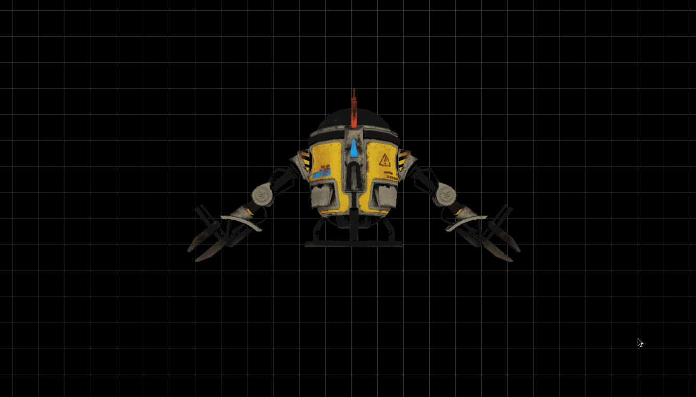

# 3drenderer

This is a study project on writing an extremely simple 3D renderer using only C and SDL2. The goal is to write a complete software rasterizer from scratch: textures, camera, clipping, loading objects all pixel per pixel, triangle by triangle and face by face.

My personal goal is to understand the basics of the math underlying the 3D world (vectors, matrices) so to apply this knowledge in packages like Houdini and be able to perform complex operations using VEX. 

# Usage

```
$ make build
# Renders the drone.obj file
$ ./renderer 
# Renders an arbitrary model
$ ./renderer -o ./assets/cube.obj -t ./assets/cube.png
```


# Progress

## Day 2


## Day 3

Now loading meshes from .OBJ files.


## Day 4/5

Different rendering modes using keystrokes as well as backface culling implemented. Naive Painter's algorithm for z-buffer.


## Day 6

Transformations are now performed using matrices instead of linear calculations. Added flat shading based on a single global illumination light.


## Day 7

Loading textures from PNG files and using UVW mapping coordinates to project them.





## Day 8

Implemented camera FPS-style control using the arrow keys. Model translation possible using W, A, S and D. Implemented clipping and a basic argument parser.